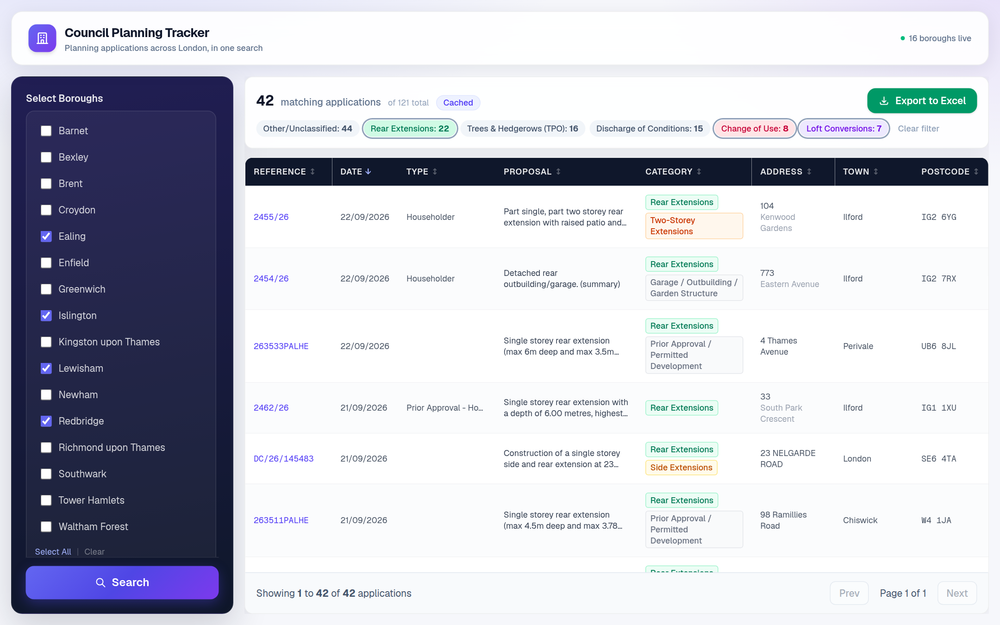
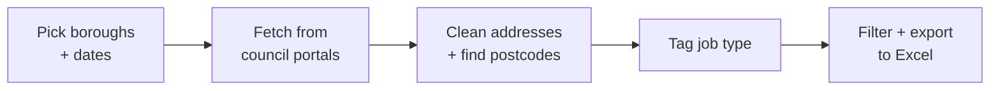
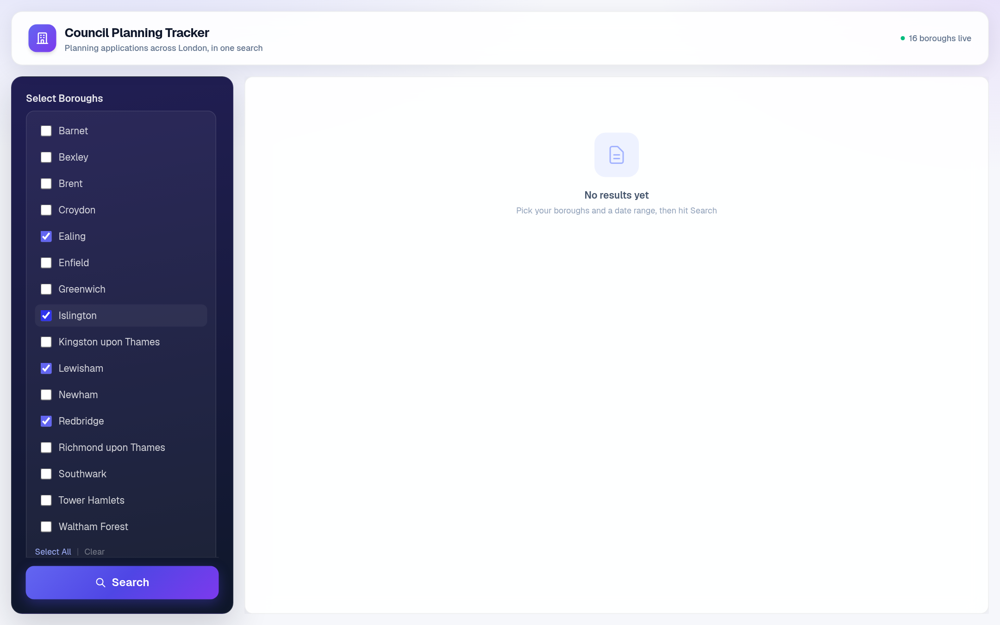
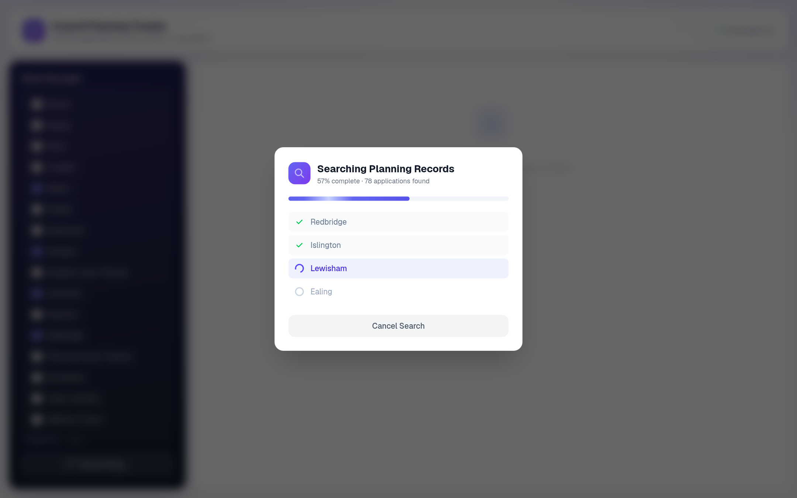
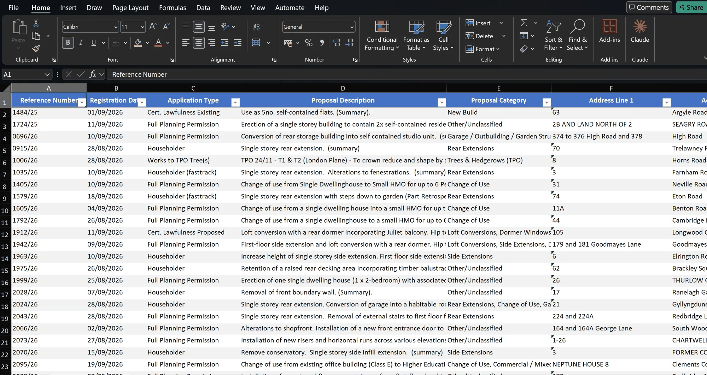

# Council Planning Tracker

**A web app that searches 16 London council planning portals at once and turns new planning applications into a clean, exportable lead list.**

> 📦 **Archived:** built for a client, no longer maintained.



---

## The problem

- A **UK construction SME** found new work by posting leaflets to homes that had just applied for planning permission, such as loft conversions or extensions.
- Finding those homes meant checking **council planning websites one by one**. Every council has its own clunky search.
- It took them **about 5 hours every week**.

## The result

| | Before | After |
|---|---|---|
| **Time per week** | ~5 hours | **~15 minutes** |
| **How** | Manual search, borough by borough | One search, all boroughs |
| **Output** | Copy-pasted notes | Tagged, cleaned **Excel file** ready for a mail-merge |
| **Coverage** | As many councils as time allowed | **16 London boroughs**, 3 different portal systems |

**Roughly 95% less time spent finding leads.**

---

## How it works

1. **Pick** your boroughs and a date range.
2. **Fetch:** the app asks each council's portal for newly registered applications. Results stream back live, borough by borough.
3. **Clean and tag:** messy addresses are split into proper fields, missing postcodes are looked up, and each job is tagged by type (loft conversion, rear extension, new build…).
4. **Filter and export:** switch on **"Buildable jobs only"** to hide noise like tree works and advert signs, then export to Excel.



**Under the hood:** every council runs one of a few portal systems, so each system gets its own **adapter**. Adding a council usually just means registering it with the right adapter.

| Portal system | How the app talks to it |
|---|---|
| **Agile Applications** | A JSON API |
| **Idox Public Access** (most councils) | Reads the search-results web pages, handling sessions, security tokens and paging |
| **Waltham Forest** (bespoke) | Its own custom adapter |

---

## Screenshots

**Demo: a search from start to finish**


**1. Choose boroughs and dates**



**2. Live progress while councils are searched**



**3. Tagged results, filtered to buildable jobs** (top of this page)

**4. The Excel export, ready for a mail-merge**



---

## Tech stack

| Tool | What it is (plain English) | Why I used it |
|---|---|---|
| **Next.js** | A framework for building websites that also run code on a server | The page and the back-end searching live in one project |
| **React** | A library for building interactive web pages | Live progress, clickable filters, sortable table |
| **TypeScript** | JavaScript with type checks | Catches mistakes before the code runs, which helps a lot with 16 different data sources |
| **Tailwind CSS** | Styling written directly in the page code | A clean, consistent look without writing separate CSS files |
| **Axios** | A tool for making web requests | Talking to the council portals and postcode services |
| **ExcelJS** | Creates Excel files in code | The one-click spreadsheet export |
| **Nominatim + postcodes.io** | Free public address and postcode lookups | Filling in missing postcodes so leaflets can actually be posted |
| **Server-Sent Events** | A way for a server to push updates to the browser | Showing each borough finish in real time instead of one long spinner |
| **Railway** | A hosting service that runs an always-on server | Suits searches that run for a minute or more |
| **Node test runner** | Node.js's built-in testing tool | 32 tests guard the trickiest parts: address parsing, job tagging and date handling |

---

## What I learned

- **Deployment is its own skill.** My first deploy was on Netlify. Council portals blocked its requests, so I moved to **Railway**, which runs a normal always-on server.
- **Real-world data is messy.** One council gives addresses with commas, another without. Postcodes are often missing. Most of the work was **cleaning data**, not fetching it.
- **Public APIs and web pages behave differently.** Some councils have a proper API; others only have web pages the app has to read. Services like Nominatim have **usage rules** (max one request per second) that the app has to respect.
- **Test with real data, not just the happy path.** Real searches exposed bugs I'd never have guessed: Croydon was quietly missing about a third of its results, Brent came back empty on wide date ranges, and one Richmond address ("Hampton Court") froze the whole server.
- **One failure shouldn't break everything.** If one council's site is down, the others still return results, and the app tells you which one failed.

---

## How I used Claude Code

This was my **first piece of custom software built for a real business**, made with Claude Code as my coding partner.

**What I decided and directed**
- The **problem and the requirements**, worked out with the client: which boroughs, which job types matter to a builder, and what the export needs for a mail-merge.
- **Testing against real council data** and spotting when results were wrong or missing, which led to most of the bug fixes above.
- **Product decisions:** grouping job types by relevance, the "Buildable jobs only" shortcut, live progress, and the move from Netlify to Railway.
- **Reviewing every change** and deciding what shipped.

**What Claude Code did**
- Wrote most of the code: the adapters, address parser, job classifier, interface and Excel export.
- Explained unfamiliar concepts as we went, such as API sessions, security tokens and Server-Sent Events.
- Diagnosed bugs from my descriptions and wrote tests to stop them coming back.

---

## Run it locally

Needs **Node 20+**.

```bash
npm install
npm run dev      # then open http://localhost:3000
npm test         # run the test suite
```

- **Config is optional.** Copy `.env.example` to `.env.local` to change timeouts, caching or the postcode-lookup limit.
- **Deploy:** `npm run build` then `npm start` on any host that runs a long-lived Node server. `railway.json` is included for Railway.
